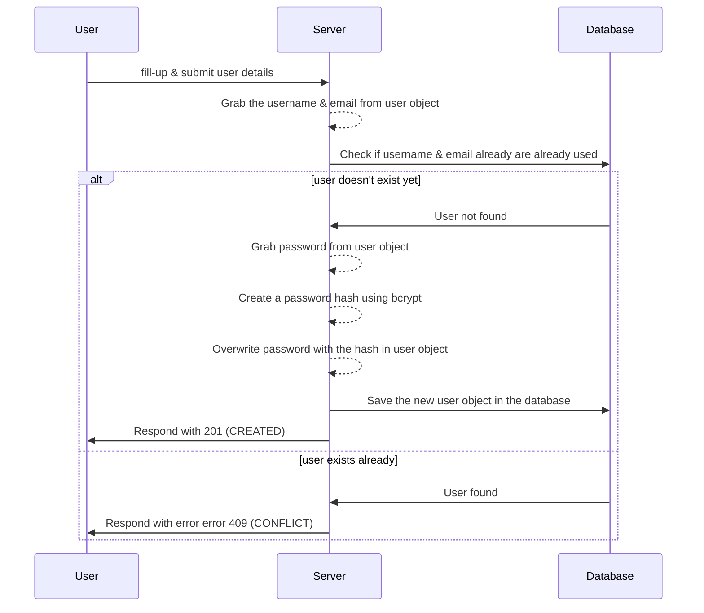

```mermaid
sequenceDiagram
    User->>Server: fill-up & submit user details
    Server-->>Server: Grab the username & email from user object
    Server->>Database: Check if username & email already are already used
    alt user doesn't exist yet
        Database->>Server: User not found
        Server-->>Server: Grab password from user object
        Server-->>Server: Create a password hash using bcrypt
        Server-->>Server: Overwrite password with the hash in user object
        Server->>Database: Save the new user object in the database
        Server->>User: Respond with 201 (CREATED)
    else user exists already
        Database->>Server: User found
        Server->>User: Respond with error error 409 (CONFLICT)
    end
```